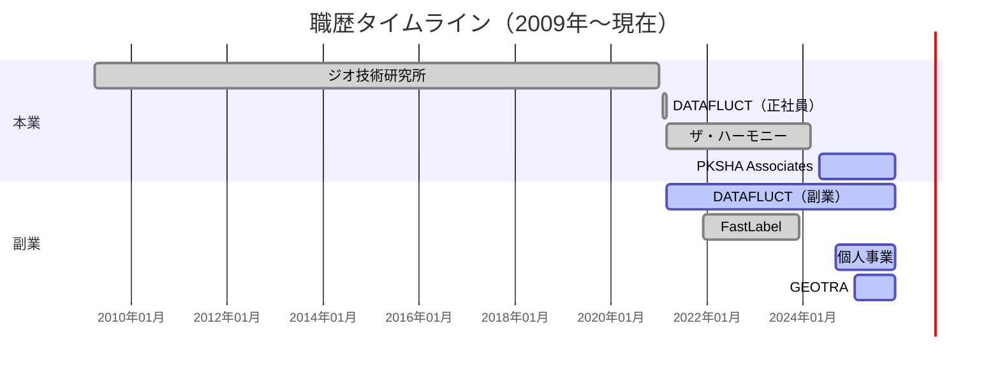
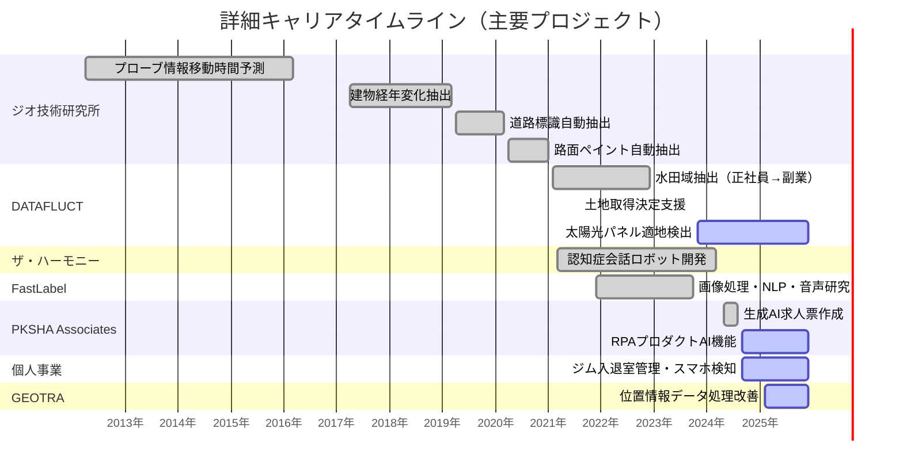
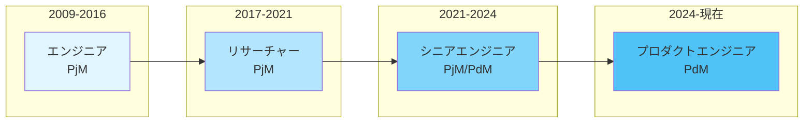
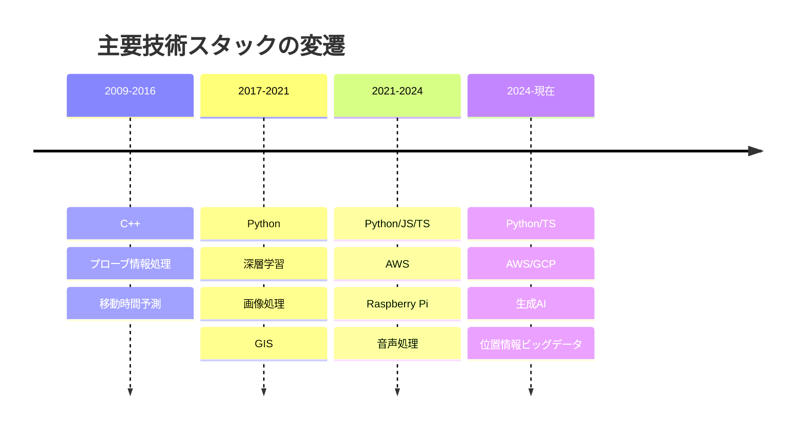

# キャリアタイムライン

## 本業・副業の時系列図

```mermaid
gantt
    title 職歴タイムライン（2009年〜現在）
    dateFormat YYYY-MM
    axisFormat %Y年%m月
    
    section 本業
    ジオ技術研究所           :done, geo, 2009-04, 2021-01
    DATAFLUCT（正社員）      :done, df1, 2021-02, 2021-03  
    ザ・ハーモニー          :done, harmony, 2021-03, 2024-03
    PKSHA Associates        :active, pksha, 2024-05, 2025-12
    
    section 副業
    DATAFLUCT（副業）       :active, df2, 2021-03, 2025-12
    FastLabel              :done, fl, 2021-12, 2023-12
    個人事業               :active, self, 2024-09, 2025-12
    GEOTRA                 :active, geotra, 2025-02, 2025-12
```

## 詳細版（プロジェクト単位）

```mermaid
gantt
    title 詳細キャリアタイムライン（主要プロジェクト）
    dateFormat YYYY-MM
    axisFormat %Y年
    
    section ジオ技術研究所
    プローブ情報移動時間予測    :done, 2012-04, 2016-03
    建物経年変化抽出          :done, 2017-04, 2019-03
    道路標識自動抽出          :done, 2019-04, 2020-03
    路面ペイント自動抽出      :done, 2020-04, 2021-01
    
    section DATAFLUCT
    水田域抽出（正社員→副業）  :done, 2021-02, 2022-12
    土地取得決定支援          :done, 2021-09, 2021-08
    太陽光パネル適地検出      :active, 2023-11, 2025-12
    
    section ザ・ハーモニー
    認知症会話ロボット開発     :done, 2021-03, 2024-03
    
    section FastLabel
    画像処理・NLP・音声研究    :done, 2021-12, 2023-10
    
    section PKSHA Associates
    生成AI求人票作成          :done, 2024-05, 2024-08
    RPAプロダクトAI機能       :active, 2024-09, 2025-12
    
    section 個人事業
    ジム入退室管理・スマホ検知 :active, 2024-09, 2025-12
    
    section GEOTRA
    位置情報データ処理改善     :active, 2025-02, 2025-12
```

## 役割の変遷

```mermaid
graph LR
    subgraph "2009-2016"
        A[エンジニア<br/>PjM]
    end
    
    subgraph "2017-2021"
        B[リサーチャー<br/>PjM]
    end
    
    subgraph "2021-2024"
        C[シニアエンジニア<br/>PjM/PdM]
    end
    
    subgraph "2024-現在"
        D[プロダクトエンジニア<br/>PdM]
    end
    
    A --> B --> C --> D
    
    style A fill:#e1f5fe
    style B fill:#b3e5fc
    style C fill:#81d4fa
    style D fill:#4fc3f7
```

## 技術スタックの変遷

```mermaid
timeline
    title 主要技術スタックの変遷
    
    2009-2016 : C++
                : プローブ情報処理
                : 移動時間予測
    
    2017-2021 : Python
                : 深層学習
                : 画像処理
                : GIS
    
    2021-2024 : Python/JS/TS
                : AWS
                : Raspberry Pi
                : 音声処理
    
    2024-現在 : Python/TS
                : AWS/GCP
                : 生成AI
                : 位置情報ビッグデータ
```