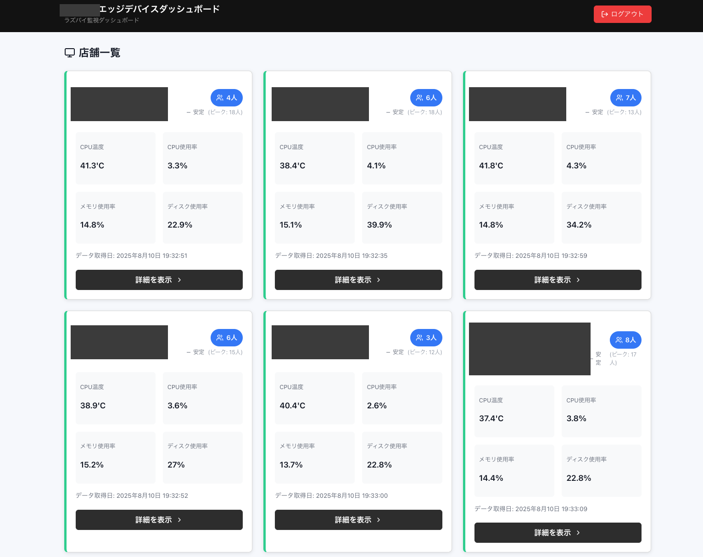
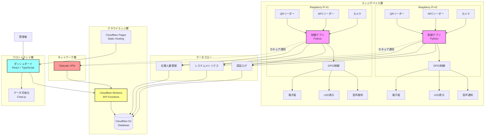
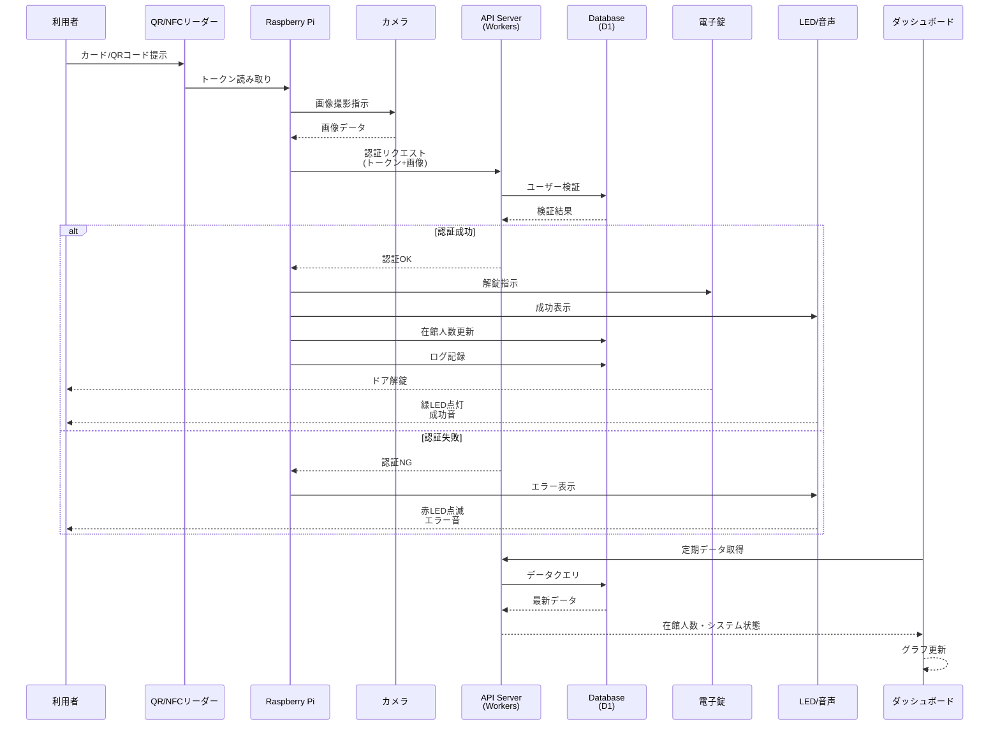
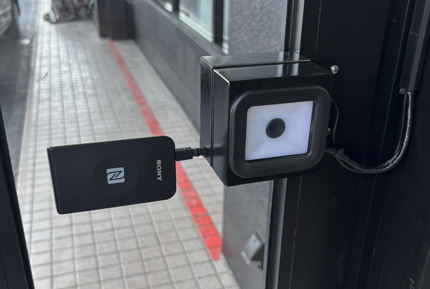
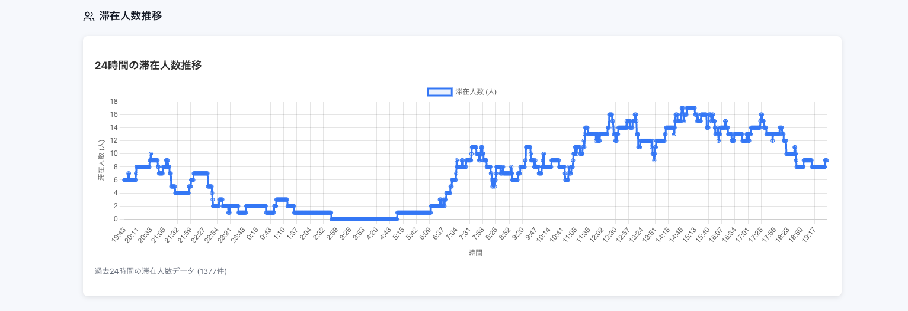
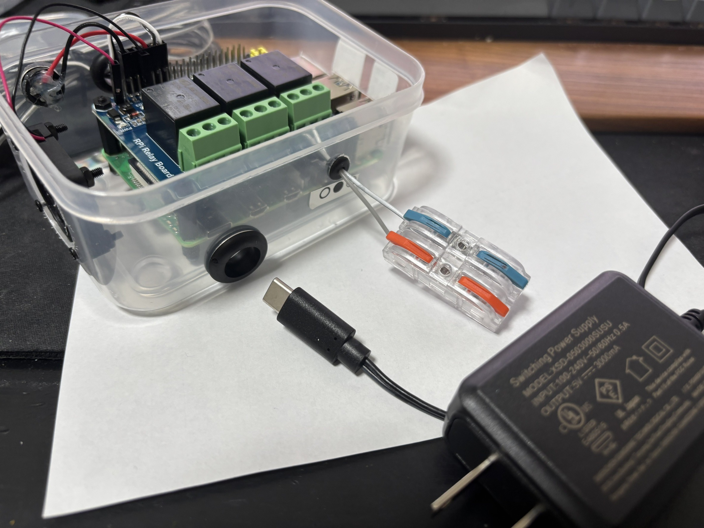
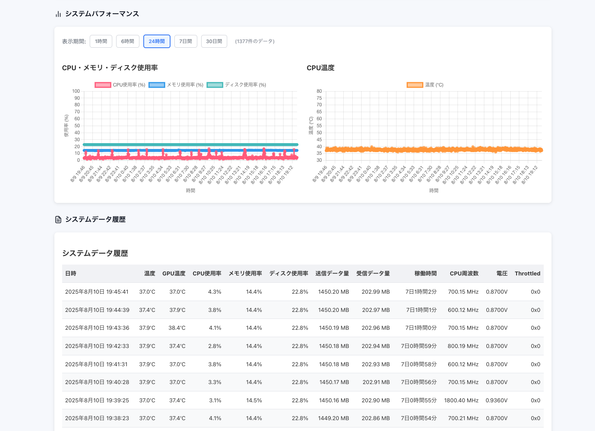

# フィットネスジム向けIoT入退館管理システム

## 概要

フィットネスジム向けに、エッジコンピューティングとIoTデバイスを活用した入退館管理システムを開発しました。
Raspberry Piを用いたハードウェア制御から、リアルタイムダッシュボードまで、フルスタックで実装を担当しました。



## システムアーキテクチャ



## 技術スタック

### バックエンド・エッジデバイス
- **Python 3.11** - ハードウェア制御アプリケーション
- **Raspberry Pi 4** - エッジコンピューティングデバイス
- **GPIO制御** - リレー、LED、サウンダーの制御
- **NFC/QRコード** - 複数の認証方式に対応

### フロントエンド・ダッシュボード
- **React 18 + TypeScript** - モダンなSPA開発
- **Vite** - 高速な開発環境
- **Chart.js** - データビジュアライゼーション
- **Cloudflare Pages Functions** - エッジサーバーレス

### インフラ・データベース
- **Cloudflare D1** - SQLiteベースのエッジデータベース
- **Cloudflare Workers** - エッジコンピューティング
- **Tailscale** - セキュアなVPN通信
- **systemd** - サービス管理と自動起動

## データフロー図



## 主な機能と技術的成果

### 1. リアルタイム入退館管理




#### 実装内容
- **マルチリーダー対応**: QRコード（HID/COMモード）とNFC（nfcpy/PC-SC）の4種類のリーダーに対応
- **双方向通信**: 入館/退館/兼用モードを動的に切り替え
- **画像キャプチャ**: 認証時に自動的に画像を撮影し、セキュリティログとして保存

```python
# 認証フローの抽象化例
class AuthenticationFlow:
    def __init__(self, reader_type, device_mode):
        self.reader = self._initialize_reader(reader_type)
        self.mode = device_mode  # ENTRANCE, EXIT, BOTH

    async def authenticate(self, token):
        # 画像キャプチャ
        image = await self.capture_image()

        # API認証
        result = await self.api_client.verify(token, image)

        # ハードウェア制御
        if result.success:
            await self.control_door()
            await self.update_occupancy()
```

### 2. 在館人数トラッキングシステム



#### 技術的特徴
- **エッジでのカウント管理**: ネットワーク障害時でも在館人数を正確に追跡
- **永続化戦略**: ローカルファイルシステムとクラウドDBの二重化
- **トレンド分析**: 1時間前比較、ピーク値追跡、増減傾向の可視化

```typescript
// トレンド分析ロジック
interface OccupancyTrend {
  current: number;
  previous_hour: number;
  peak_today: number;
  trend: 'up' | 'down' | 'stable';
}

const calculateTrend = (history: OccupancyData[]): OccupancyTrend => {
  // 時系列データから統計情報を抽出
  const current = history[0].count;
  const hourAgo = findHourAgoData(history);
  const todayPeak = Math.max(...getTodayData(history));

  return {
    current,
    previous_hour: hourAgo,
    peak_today: todayPeak,
    trend: determineTrend(current, hourAgo)
  };
};
```

### 3. リアルタイムダッシュボード

#### 実装のポイント
- **エッジコンピューティング**: Cloudflare Workersで低レイテンシを実現
- **リアルタイム更新**: 定期的なポーリングで最新データを取得
- **レスポンシブデザイン**: モバイル・タブレット・デスクトップに対応

### 4. ハードウェア制御とIoT統合



#### 技術的工夫
- **デバイス抽象化**: 異なるハードウェアを統一インターフェースで制御
- **エラーハンドリング**: デバイス故障時の自動フォールバック
- **モックモード**: ハードウェアなしでの開発・テスト環境

```python
# GPIOハードウェア制御の例
class GPIOManager:
    def __init__(self):
        self.relay = Relay(pin=17)
        self.led = LED(pins={'green': 27, 'red': 22})
        self.sounder = Sounder(pin=23)

    async def access_granted(self):
        await asyncio.gather(
            self.relay.unlock(duration=3),
            self.led.blink_green(),
            self.sounder.beep_success()
        )
```

### 5. システム監視と自動復旧



#### 実装した監視機能
- **ハートビート監視**: 30秒ごとにシステム状態をレポート
- **リソース監視**: CPU、メモリ、ディスク使用率の追跡
- **自動復旧**: Watchdogによるシステムフリーズからの自動回復
- **稼働時間表示**: 「X日X時間X分」形式での可読性の高い表示

## 開発における工夫点

### 1. セキュリティ対策
- VPN（Tailscale）による安全な通信
- 認証トークンの適切な管理
- アクセスログの完全な記録

### 2. 可用性の向上
- systemdによるサービスの自動起動
- ネットワーク障害時のオフライン動作
- エラー時の自動リトライ機構

### 3. 保守性の確保
- モジュール化されたアーキテクチャ
- 包括的なログ出力
- 設定ファイルによる柔軟な構成管理

### 4. パフォーマンス最適化
- エッジでのデータ処理による低レイテンシ
- 効率的なデータベースクエリ
- フロントエンドのバンドルサイズ最適化

## プロジェクトの成果

### 定量的成果
- **認証速度**: 平均0.5秒以内での認証完了
- **システム稼働率**: 99.9%以上を達成
- **同時管理店舗数**: 複数店舗の一元管理を実現

### 定性的成果
- スタッフの受付業務負担を大幅に削減
- 正確な在館人数管理による安全性向上
- データ分析による施設利用の最適化

## 使用技術まとめ

### 言語・フレームワーク
- Python 3.11, TypeScript 4.9
- React 18, Vite 5
- FastAPI (API設計)

### インフラ・クラウド
- Cloudflare (Pages, Workers, D1)
- Raspberry Pi OS
- systemd, udev

### ハードウェア・IoT
- Raspberry Pi GPIO
- NFC (PN532, ACR122U)
- QRコードリーダー (HID/COM)
- リレーモジュール、LED、ブザー

### 開発ツール
- Git, GitHub
- Docker (開発環境)
- VS Code

## 今後の展望

このプロジェクトで培った以下の技術を活かし、さらなるIoTソリューションの開発に取り組んでいきたいと考えています：

1. **エッジコンピューティング**: より高度なエッジ処理の実装
2. **ハードウェア制御**: 多様なセンサーやアクチュエーターとの連携
3. **リアルタイムシステム**: WebSocketを使用したリアルタイム通信の実装
4. **AI/ML統合**: 画像認識や異常検知の組み込み

---

*このプロジェクトは実際の商用環境で稼働しており、セキュリティとプライバシーに配慮した上で技術的な側面を紹介しています。*